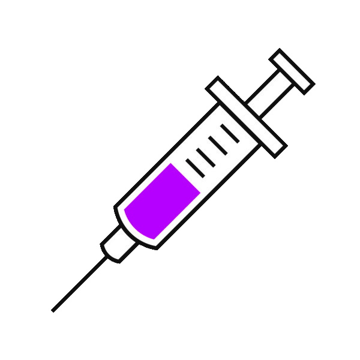
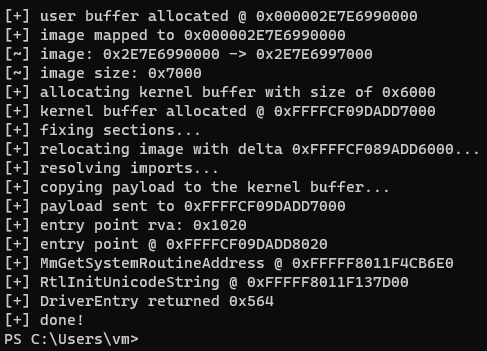

# anymapper

x64 Windows kernel driver mapper, inject unsigned driver using anycall

This project is WIP.

# Todo

- Fix: Can't make API calls from IAT nor function pointer

# License

MIT copyright Kento Oki \<hrn832@protonmail.com\>
